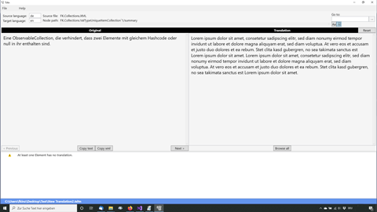

# Tsltn

Tool to translate the Visual Studio XML documentation file into different languages (for the localization of Visual Studio IntelliSense and project reference).

[Download Tsltn for Windows x64 (Windows 7 - 10)](https://github.com/FolkerKinzel/Tsltn/releases/tag/2.5)

Tsltn is a standalone GUI, that enables you
* to keep your translated files in sync with the original file,
* to translate only the required sections (to skip some XML attributes and the code sections), and
* it only prompts you to retranslate a section, when there are significant changes in it and
* checks the translated sections for XML errors.

Tsltn creates its own *.tsltn file type, which is a XML file, that holds your translations of the sections of
the original file together with a special hash, that connects the translations stably with the corresponding 
sections of the original file.

Tsltn is completely free of charge, even for commercial purposes.

