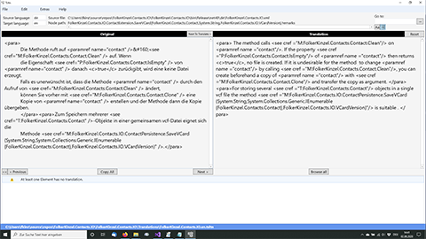

# Tsltn

Tool to translate the Visual Studio XML documentation file into different languages (for the localization of IntelliSense and project reference).

[Download Tsltn for Windows x64 (Windows 7 - 10)](https://github.com/FolkerKinzel/Tsltn/releases/tag/2.3)

Tsltn is a standalone GUI, that enables you
* to keep your translated files in sync with the original file,
* to translate only the required sections (to skip attributes and code sections), and
* it only prompts you to retranslate a section, when there are significant changes in it.

